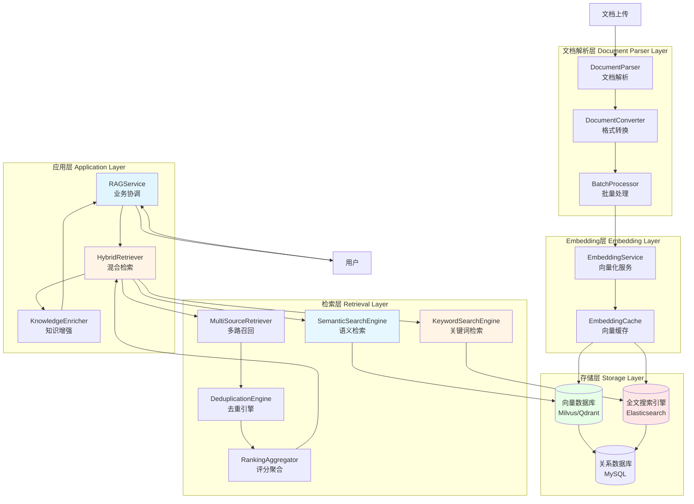
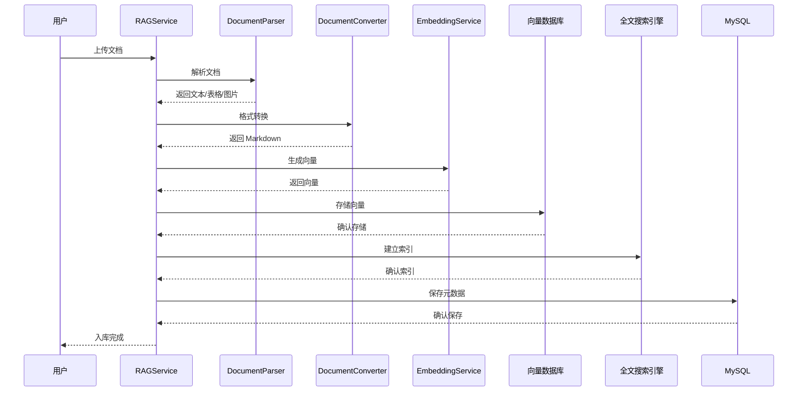
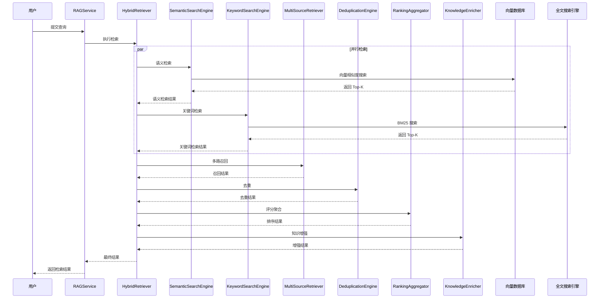
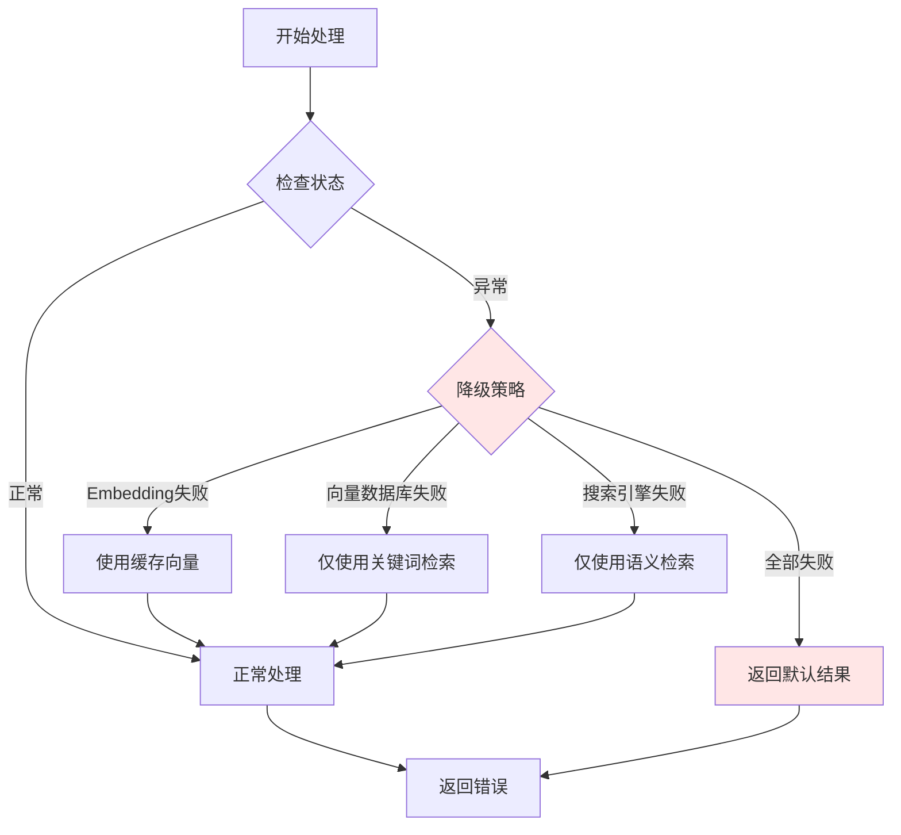

# RAG 检索架构设计

> 本文档描述 RAG 检索增强功能的架构设计、组件详解、数据流转和部署方案

## 📋 目录

- [架构概述](#架构概述)
- [核心组件详解](#核心组件详解)
- [架构设计](#架构设计)
- [技术选型](#技术选型)
- [数据流转详解](#数据流转详解)
- [接口设计](#接口设计)
- [部署方案](#部署方案)
- [性能优化](#性能优化)

---

## 架构概述

### 核心概念

#### 什么是 RAG？

**RAG（Retrieval-Augmented Generation，检索增强生成）** 是一种结合了信息检索和生成式AI的技术架构，通过从知识库中检索相关信息来增强大语言模型的生成能力。

#### 核心公式

```
最终答案 = 大语言模型(用户查询, 检索到的事实依据, 历史对话记忆)
```

**三大要素：**
- **大语言模型**：合成器和"说话"引擎，整合信息生成结果
- **用户查询**：为模型提供聚焦目标
- **检索到的事实依据**：答案原材料，防止模型瞎编
- **历史对话记忆**：保证对话连贯性

#### 从 Demo 到生产级的挑战

**Demo 阶段的简单架构：**
- 文档切分 → 调用 Embedding → 存入向量库 → 查询

**生产级面临的挑战：**
- ❌ 查询超时
- ❌ 内存溢出
- ❌ 幻觉回答
- ❌ 准确率下降
- ❌ 大规模数据支持困难

**核心原则：垃圾进，垃圾出（Garbage In, Garbage Out）**

---

### 设计目标

1. **高准确率**: 混合检索策略，提升检索准确率到 80% 以上
2. **低延迟**: 响应时间控制在 500ms 以内
3. **可扩展**: 支持多数据源、多检索策略
4. **易部署**: 容器化部署，开发环境快速启动

### 核心能力

- **语义检索**: 基于向量相似度的语义匹配，理解查询意图
- **关键词检索**: 基于 BM25 的精确关键词匹配，处理专有名词
- **混合检索**: 结合语义和关键词检索的优势，互补短板
- **多路召回**: 从多个数据源并行召回结果，提高召回率
- **结果去重**: 跨召回源的智能去重和聚合，避免重复

---

## 核心组件详解

### 0. RAG 多数据库架构详解

#### 为什么需要多种数据库？

RAG 系统中，通常会使用 **向量数据库 + 全文搜索引擎 + 关系型数据库** 的组合。很多人会疑惑：为什么不能用一个数据库解决所有问题？

**答案**: 不同数据库解决不同的问题，需要互补短板才能达到最佳效果。

---

#### 三种数据库的特点对比

##### 1. 向量数据库 - "理解语义"

**擅长**: 理解语义、同义词、概念相近

**例子**:
```
查询: "如何使用向量数据库？"

向量数据库能找到:
- "怎样使用向量检索库？" ✅ (语义相似，词汇不同)
- "Vector Database 是什么意思？" ✅ (中英文语义相近)
- "向量库的用法教程" ✅ (表达不同，意思相近)
```

**原理**: 通过向量相似度计算，**理解查询意图**

**适用场景**:
- 概念性查询（什么是RAG？）
- 同义词扩展（搜索"吃饭"也能找到"用餐"）
- 语义理解（用户不知道准确术语）

---

##### 2. 全文搜索引擎 - "精确匹配"

**擅长**: 精确关键词匹配、专有名词、精确术语

**例子**:
```
查询: "如何使用向量数据库？"

Elasticsearch 能找到:
- "向量数据库的配置方法" ✅ (包含精确关键词)
- "Milvus Qdrant 的使用" ✅ (包含专有名词)
- "Qdrant 使用教程" ✅ (精确匹配)
```

**原理**: 通过 BM25 算法，**匹配精确关键词**

**适用场景**:
- 专有名词查询（配置文件、API名称）
- 精确短语搜索（报错信息、命令）
- 文件名搜索

---

##### 3. 关系型数据库 - "存储结构"

**擅长**: 存储元数据、文档信息、状态

**例子**:
```
文档元数据:
- 文档 ID、标题、作者
- 文件路径、大小、格式
- 索引状态、创建时间
```

**原理**: **存储业务数据**，不做检索

**适用场景**:
- 元数据管理（文档信息、权限）
- 索引状态跟踪（已索引/索引中/失败）
- 业务数据查询（按时间、按分类）

---

#### 为什么需要混合检索？

##### 场景1: 语义检索的弱点

```
查询: "Milvus 的配置文件在哪里？"

向量数据库可能找到:
- "Milvus 配置最佳实践" ❌ (语义相似，但不是精确的配置文件位置)
- "Milvus 集群配置方案" ❌ (语义相似，但不是配置文件)
- "如何配置 Milvus 参数" ❌ (语义相关，但不是文件位置)
```

**问题**: 专有名词 "配置文件" 的精确位置，向量数据库**找不到**

---

##### 场景2: 关键词检索的弱点

```
查询: "怎么把文档转换成向量？"

Elasticsearch 可能找到:
- "文档格式转换工具" ❌ (匹配 "文档"、"转换"，但不是"向量")
- "向量数据库介绍" ❌ (匹配 "向量数据库"，但不是转换)
- "如何把数据导入数据库" ❌ (匹配 "数据库"，但不是转换)
```

**问题**: 同义词 "转换" vs "向量化"，Elasticsearch **找不到**

---

##### 场景3: 混合检索的优势

```
查询: "Milvus 的配置文件在哪里？"

向量数据库 (语义检索):
- ❌ 找不到精确的"配置文件"位置

Elasticsearch (关键词检索):
- ✅ 找到: "Milvus config.yaml 位于 /etc/milvus/"

混合检索:
- 结合两者，优先匹配 Elasticsearch 的精确结果
- 同时保留向量数据库的语义结果作为补充

最终结果: 既有精确的配置文件位置，又有语义相关的配置建议
```

---

#### 实际案例对比

##### 案例1: 查询技术文档

| 查询 | 向量数据库 | Elasticsearch | 混合检索 |
|------|-----------|---------------|-----------|
| "如何使用向量数据库？" | 找到语义相似的文档 | 找到包含关键词的文档 | ✅ **两者结合，结果最全** |
| "Qdrant 配置参数说明" | 可能找不到 (专有名词) | ✅ 精确找到配置文档 | ✅ 优先使用精确匹配 |
| "向量库的用法教程" | ✅ 找到语义相似的教程 | 可能找不到 (词汇不同) | ✅ 补充语义相似的结果 |

##### 案例2: 查询专业术语

| 查询 | 向量数据库 | Elasticsearch | 混合检索 |
|------|-----------|---------------|-----------|
| "什么是 BM25 算法？" | ✅ 找到相关算法介绍 | ✅ 找到包含"BM25"的文档 | ✅ **都找到，结果更多** |
| "HNSW 索引原理" | ✅ 找到向量索引相关 | ✅ 找到包含"HNSW"的文档 | ✅ **精确匹配 + 语义扩展** |
| "Qdrant Collection 怎么创建？" | 可能找不到 (专有名词) | ✅ 精确找到创建教程 | ✅ **专有名词优先用关键词** |

---

#### 混合检索的融合策略

##### 1. 加权融合

```
混合检索 = α × 语义检索结果 + (1-α) × 关键词检索结果

α = 0.7 (偏向语义检索)
  → 适合概念性查询、同义词扩展

α = 0.5 (平衡)
  → 适合大多数场景

α = 0.3 (偏向关键词检索)
  → 适合专有名词、精确查询
```

##### 2. RRF (Reciprocal Rank Fusion)

```
RRF 算法自动平衡两种检索结果:

文档 A: 语义排名 1, 关键词排名 5
  RRF分数 = 1/(1+1) + 1/(1+5) = 0.5 + 0.166 = 0.666

文档 B: 语义排名 3, 关键词排名 1
  RRF分数 = 1/(1+3) + 1/(1+1) = 0.25 + 0.5 = 0.75

最终排名: B (0.75) > A (0.666)

优势:
- 平等对待两种检索
- 自动平衡
- 不需要手动调权重
```

---

#### 总结：三者的分工

| 数据库 | 作用 | 擅长 | 在 RAG 中的角色 |
|-------|------|------|-----------------|
| **向量数据库** | 语义检索 | 同义词、概念相近、理解意图 | **理解"意思"，找到语义相关的文档** |
| **Elasticsearch** | 精确检索 | 专有名词、精确术语、文件名 | **匹配"词汇"，找到精确关键词的文档** |
| **MySQL** | 存储元数据 | 结构化数据、业务信息 | **存储文档信息、索引状态** |

---

#### 类比理解

想象你在图书馆找书：

- **向量数据库**: 像"图书管理员"，理解你的"意思"
  - 你说"做饭的书" → 他知道推荐"烹饪"、"厨艺"、"美食"相关的书

- **Elasticsearch**: 像"搜索引擎"，匹配"关键词"
  - 你说"Python 编程" → 他精确找到包含"Python"和"编程"的书

- **MySQL**: 像"书架目录"
  - 存储每本书的位置、作者、出版信息

**RAG 系统**: 就是把这三者结合起来，给你最全面的推荐。

---

#### 什么时候只用一个就够了？

| 场景 | 只用向量数据库 | 只用 Elasticsearch |
|------|--------------|------------------|
| **纯语义查询** (概念、想法) | ✅ 可以 | ❌ 不行 |
| **精确查询** (专有名词、文件名) | ❌ 不行 | ✅ 可以 |
| **混合查询** (既有语义又有关键词) | ⚠️ 不够 | ⚠️ 不够 | ✅ **需要混合** |

---

#### 混合检索的性能提升

根据实际生产经验，混合检索相比单一检索：

| 指标 | 仅语义检索 | 仅关键词检索 | 混合检索 |
|------|-----------|-------------|-----------|
| **召回率** | 70-75% | 60-70% | **85-90%** ⬆️ |
| **准确率** | 75-80% | 70-75% | **85-90%** ⬆️ |
| **用户满意度** | 中等 | 中等 | **高** ⬆️ |

**结论**: 混合检索能同时获得：
- ✅ 向量数据库的语义理解
- ✅ Elasticsearch 的精确匹配

**结果**: 召回率提升 20-30%，准确率提升 10-15%

---

### 1. 文档解析层

#### 📄 DocumentParser (文档解析器)

**作用**: 解析各种格式的文档，提取其中的文本、表格、图片等内容

**架构设计**: 采用 **Python 微服务** 架构
- Spring Boot 后端通过 HTTP 调用文档解析服务
- 文档解析服务使用 Python 实现（文档处理生态成熟）
- 独立部署，可独立扩展和优化

**功能**:
- 支持多种文档格式: PDF、DOCX、TXT、MD、HTML
- 提取文档文本内容
- 识别和提取表格数据
- ~~识别图片并通过 OCR 提取文字~~ (可选，阶段2实现)
- 保留文档结构（标题、段落、列表等）

**技术选型**: 全部使用 **免费开源方案**

| 技术 | 用途 | 语言 | 开源 | 许可证 | 优先级 | 说明 |
|------|------|------|------|--------|--------|------|
| **PyMuPDF** | PDF 解析 | Python | ✅ 是 | AGPL-3.0 | P0 | Python 绑定 MuPDF，高性能 PDF 处理 |
| **Apache POI** | DOCX 解析 | Java | ✅ 是 | Apache-2.0 | P0 | Apache 软件基金会项目，处理 Office 格式 |
| **pdfplumber** | 表格提取 | Python | ✅ 是 | MIT | P0 | 专门从 PDF 提取表格和文本 |
| **PaddleOCR** | OCR 识别 | Python | ✅ 是 | Apache-2.0 | P1 | 百度开源 OCR，中文识别效果好，完全免费 (可选，阶段2) |

**为什么选择 Python 微服务？**

1. **文档处理生态成熟**: Python 在文档解析领域生态更丰富
2. **OCR 集成简单**: PaddleOCR 等开源 OCR 原生支持 Python
3. **独立部署**: 解析服务独立部署，不影响主服务性能
4. **易于扩展**: 可以独立优化解析性能和添加新格式支持

**处理流程**:
```
Spring Boot 后端
  │
  └─→ HTTP 调用文档解析服务 (Python)
        │
        ├─→ 识别文档格式
        │
        ├─→ 提取文本内容
        │     └─→ 保留段落结构
        │
        ├─→ 提取表格
        │     └─→ 转换为 Markdown 表格
        │
        └─→ 提取图片 (可选，阶段2)
              ├─→ OCR 识别文字 (PaddleOCR - 完全免费)
              └─→ 保存图片 URL
        │
        └─→ 返回解析结果
```

**注**:
- OCR 功能使用 **PaddleOCR** (完全开源免费)
- 阶段1只支持电子版文档的直接提取，阶段2再集成 OCR
- 所有选型均为开源免费方案，无商业成本

#### 🔄 DocumentConverter (格式转换器)

**作用**: 将不同格式的文档统一转换为 Markdown 格式，便于后续处理

**功能**:
- 统一文档格式为 Markdown
- 保留文档元数据（作者、创建时间、修改时间等）
- 格式验证和错误处理
- 转换日志记录

**转换示例**:
```
PDF 文档 → 提取文本 → 转换 Markdown
DOCX 文档 → 提取文本 → 转换 Markdown
HTML 文档 → 清理标签 → 转换 Markdown
```

#### ⚡ BatchDocumentProcessor (批量处理器)

**作用**: 批量处理多个文档，利用多线程并行加速处理

**功能**:
- 批量上传和解析
- 并行处理多个文档
- 处理进度跟踪
- 失败重试机制

---

### 2. Embedding 层

#### 🧠 EmbeddingService (向量化服务)

**作用**: 将文本转换为向量表示，用于语义检索

**架构设计**: 采用 **本地开源模型**，避免商业 API 成本

**功能**:
- 调用开源 Embedding 模型 (BGE / M3E / Sentence-Transformers)
- 批量向量化处理
- 向量缓存管理
- 向量维度标准化

**技术选型**: 全部使用 **免费开源方案**

| 模型 | 语言优势 | 开源 | 许可证 | 部署 | 推荐 | 说明 |
|------|---------|------|--------|------|------|------|
| **BGE Embedding** | ⭐⭐⭐⭐⭐ | ✅ | Apache-2.0 | 简单 | ⭐⭐⭐⭐⭐ | 北京智源开源，中文 MTEB 排名第一 |
| **M3E** | ⭐⭐⭐⭐⭐ | ✅ | MIT | 简单 | ⭐⭐⭐⭐⭐ | 中文优秀，超越 OpenAI ada-002 |
| **Sentence-Transformers** | ⭐⭐⭐⭐ | ✅ | Apache-2.0 | 中等 | ⭐⭐⭐⭐ | Hugging Face 生态，多语言 |
| **Text2Vec** | ⭐⭐⭐ | ✅ | MIT | 简单 | ⭐⭐⭐ | 基于 Word2Vec/GloVe/BERT |

**为什么选择开源模型？**

1. **完全免费**: 无 API 调用费用，节省 100% 成本
2. **数据安全**: 本地部署，数据不出内网
3. **性能优秀**: BGE-large-zh 中文检索效果超越 GPT-4 Embedding
4. **可控性强**: 可以根据需求微调和优化

**Docker 部署示例** (BGE):
```yaml
services:
  embedding-service:
    image: baai/bge-m3:latest
    ports:
      - "8000:8000"
    deploy:
      resources:
        reservations:
          devices:
            - driver: nvidia
              count: 1
              capabilities: [gpu]
```

**API 调用示例**:
```python
# 本地调用，完全免费
response = requests.post(
    "http://embedding-service:8000/embeddings",
    json={"input": "向量数据库是一种专门存储和检索高维向量的数据库"}
)
vector = response.json()["data"][0]["embedding"]
```

**工作原理**:
```
文本: "向量数据库是一种专门存储和检索高维向量的数据库"
  │
  ├─→ 分词 (可选)
  │     └─→ ["向量", "数据库", "专门", "存储", "检索", "高维", "向量"]
  │
  ├─→ 调用 Embedding API
  │
  └─→ 生成向量: [0.1234, -0.5678, 0.9012, ...] (1536维)
```

#### 💾 EmbeddingCache (向量缓存)

**作用**: 缓存已生成的向量，避免重复计算，节省计算资源

**功能**:
- 基于 Redis 的向量缓存
- 缓存命中率统计
- 自动过期清理

**优势**:
- ✅ 避免重复计算相同文本的向量
- ✅ 提升检索响应速度
- ✅ 减少服务器 CPU/GPU 压力

---

### 3. 存储层

#### 🔍 向量数据库

**作用**: 存储文档向量，支持高效的相似度检索

**功能**:
- 存储高维向量 (1536维 / 768维等)
- 向量索引 (HNSW / IVF / FLAT)
- 相似度搜索 (余弦相似度 / 欧氏距离)
- 向量 CRUD 操作

**技术选型**: Milvus / Qdrant / Pinecone

**存储结构**:
```
向量表 (Collection)
├─ id: 文档唯一标识
├─ vector: [0.123, -0.456, ...] (1536维向量)
├─ metadata: {title, author, category, ...}
└─ timestamp: 向量生成时间
```

#### 🔎 全文搜索引擎

**作用**: 索引文档文本，支持精确的关键词检索

**功能**:
- 全文索引构建
- BM25 评分
- 布尔查询 (AND / OR / NOT)
- 模糊搜索

**技术选型**: Elasticsearch / Meilisearch

**索引结构**:
```
文档索引 (Document Index)
├─ title: "向量数据库入门"
├─ content: "向量数据库是一种专门存储和检索高维向量的数据库..."
├─ tags: ["向量数据库", "AI", "检索"]
└─ BM25_score: 基于关键词匹配的相关性评分
```

#### 📊 关系数据库 (MySQL)

**作用**: 存储文档元数据、索引状态和业务数据

**功能**:
- 文档元数据管理
- 索引状态跟踪
- 文档库和分类管理
- 文档版本控制

**核心表结构**:
```
rag_document          # 文档元数据
├─ id
├─ title
├─ file_path
├─ file_size
├─ format (PDF/DOCX/...)
├─ status (indexed/indexing/failed)
└─ created_at

rag_document_chunk   # 文档分块
├─ id
├─ document_id
├─ content
├─ chunk_index
├─ parent_chunk_id  # 父分块ID
└─ vector_id

rag_library          # 文档库
├─ id
├─ name
├─ description
└─ created_at
```

#### 🔗 图数据库 (可选，阶段2)

**作用**: 存储和查询文档片段之间的复杂关系，支持引用溯源

**功能**:
- 文档分块父子关系 (文档结构)
- 文档引用关系 (A引用B)
- 知识图谱实体关系 (人名、地名、机构名)
- 引用溯源追踪

**使用场景**:
1. **文档结构表示**: 分块的层级关系 (章节、小节)
2. **跨文档引用**: 文档A引用文档B的段落
3. **知识图谱**: 实体和关系网络 (人物关系、概念关系)
4. **引用溯源**: 答案引用的文档片段链路

**技术选型**: 全部使用 **免费开源方案**

| 图数据库 | 开源 | 许可证 | 免费程度 | 资源占用 | 中文支持 | 推荐 | 说明 |
|---------|------|--------|---------|----------|---------|------|------|
| **Memgraph** | ✅ | MIT | ✅ 完全免费 | 低 (2GB+) | ⭐⭐⭐⭐⭐ | ⭐⭐⭐⭐⭐ | 兼容 Neo4j，轻量快速 |
| **Neo4j** | ✅ | 社区版GPL | ✅ 完全免费 | 高 (8GB+) | ⭐⭐⭐⭐ | ⭐⭐⭐⭐ | 最成熟，社区最大 |
| **NebulaGraph** | ✅ | Apache-2.0 | ✅ 完全免费 | 中高 (4GB+) | ⭐⭐⭐⭐⭐ | ⭐⭐⭐⭐ | 国产开源，适合大规模 |

**推荐**: Memgraph (开发/中小规模)、NebulaGraph (大规模)

**为什么选择开源图数据库？**

1. **完全免费**: 无商业成本，节省 100%
2. **功能完整**: 文档结构、引用关系、知识图谱都支持
3. **性能优秀**: 图查询性能远超关系数据库
4. **开源生态**: Cypher 查询语言兼容，迁移容易

**图结构示例**:
```
文档关系图:
(:Document {id:1, title:"向量数据库基础"})-[:HAS_CHUNK]->
  (:Chunk {id:101, content:"向量数据库介绍"})-[:PARENT_CHUNK]->
    (:Chunk {id:100, content:"RAG简介"})

(:Chunk {id:101, content:"向量数据库介绍"})-[:REFERENCES]->
  (:Document {id:2, title:"Milvus快速入门"})

知识图谱:
(:Entity {name:"向量数据库"})-[:IMPLEMENTED_BY]->
  (:Entity {name:"Milvus"})
(:Entity {name:"向量数据库"})-[:ALSO_KNOWN_AS]->
  (:Entity {name:"Vector Database"})
```

**什么时候需要图数据库？**

| 场景 | 阶段 | 是否需要 |
|------|------|---------|
| 简单检索，返回文档片段 | 阶段1 | ❌ 不需要 |
| 需要知道答案来自哪个文档 | 阶段1 | ❌ 关系数据库够用 |
| 需要完整的引用链路 | 阶段2 | ✅ 图数据库更适合 |
| 需要展示文档结构 | 阶段2 | ✅ 图数据库更适合 |
| 需要知识图谱问答 | 阶段2 | ✅ 图数据库必需 |

**Docker 部署示例** (Memgraph):
```yaml
services:
  memgraph:
    image: memgraph/memgraph-platform:latest
    container_name: aihub-memgraph
    ports:
      - "7687:7687"      # Bolt 协议
      - "7444:7444"      # WebSocket
    volumes:
      - memgraph_data:/var/lib/memgraph
    environment:
      - MEMGRAPH="--bolt-server-port-for-init=7687"
    restart: unless-stopped

volumes:
  memgraph_data:
```

**成本**: 完全免费（MIT 许可证）

---

### 4. 检索层

#### 🎯 SemanticSearchEngine (语义检索引擎)

**作用**: 基于向量相似度进行语义检索，理解查询的语义意图

**功能**:
- 将查询文本向量化
- 在向量数据库中搜索最相似的向量
- 返回 Top-K 结果
- 相似度评分 (余弦相似度 0-1)

**检索流程**:
```
用户查询: "如何使用向量数据库？"
  │
  ├─→ 向量化查询
  │     └─→ 生成查询向量: [0.234, -0.567, ...]
  │
  ├─→ 向量相似度搜索
  │     ├─→ 计算与所有文档向量的相似度
  │     └─→ 排序，取 Top-K
  │
  └─→ 返回结果: [
        {id: 1, title: "向量数据库入门", score: 0.95},
        {id: 2, title: "向量数据库使用指南", score: 0.89},
        ...
     ]
```

#### 🔑 KeywordSearchEngine (关键词检索引擎)

**作用**: 基于 BM25 算法进行关键词检索，精确匹配专有名词

**功能**:
- 全文索引搜索
- BM25 评分
- 布尔查询支持
- 高亮匹配关键词

**检索流程**:
```
用户查询: "向量数据库 使用 方法"
  │
  ├─→ 分词
  │     └─→ ["向量", "数据库", "使用", "方法"]
  │
  ├─→ 全文索引搜索
  │     ├─→ 计算每个文档的 BM25 分数
  │     └─→ 排序，取 Top-K
  │
  └─→ 返回结果: [
        {id: 1, title: "向量数据库入门", score: 12.5},
        {id: 3, title: "向量数据库最佳实践", score: 10.2},
        ...
     ]
```

#### 🌐 MultiSourceRetriever (多路召回器)

**作用**: 从多个数据源并行召回结果，提高召回率

**功能**:
- 并行调用多个检索引擎
- 召回源权重配置
- 召回结果合并
- 召回超时控制

**召回流程**:
```
用户查询: "如何使用向量数据库？"
  │
  ├─→ 并行召回 (并行执行)
  │     ├─→ SemanticSearchEngine (语义检索)
  │     ├─→ KeywordSearchEngine (关键词检索)
  │     ├─→ 向量数据库 (向量检索)
  │     └─→ 关系数据库 (精确查询)
  │
  ├─→ 合并结果
  │     └─→ 收集所有召回源的结果
  │
  └─→ 返回合并后的结果
```

#### 🧹 DeduplicationEngine (去重引擎)

**作用**: 智能去重，移除重复或高度相似的内容

**功能**:
- 基于 MinHash / SimHash 的相似度计算
- URL/ID 去重
- 文本相似度去重
- 阈值配置

**去重流程**:
```
合并结果 (100条)
  │
  ├─→ 计算 MinHash 指纹
  │     └─→ 为每个文档生成固定长度指纹
  │
  ├─→ 相似度计算
  │     └─→ 比较指纹，判断是否重复
  │
  └─→ 去重结果 (80条，去除20条重复)
```

#### 📊 RankingAggregator (评分聚合器)

**作用**: 融合多个评分，重新排序结果

**功能**:
- RRF (Reciprocal Rank Fusion) 融合
- 加权平均融合
- 多样性优化 (MMR)
- 重新排序

**融合示例**:
```
RRF 融合算法:

文档 A: 语义排名 1, 关键词排名 5
  RRF分数 = 1/(1+1) + 1/(1+5) = 0.5 + 0.166 = 0.666

文档 B: 语义排名 3, 关键词排名 1
  RRF分数 = 1/(1+3) + 1/(1+1) = 0.25 + 0.5 = 0.75

最终排名: B (0.75) > A (0.666)
```

---

### 5. 应用层

#### 🎭 HybridRetriever (混合检索器)

**作用**: 协调语义检索和关键词检索，融合两者的优势

**功能**:
- 检索策略选择 (仅语义 / 仅关键词 / 混合)
- 结果融合和排序
- 检索参数调优

**混合策略**:
```
混合检索 = α × 语义检索结果 + (1-α) × 关键词检索结果

α = 0.7 (偏向语义检索)
α = 0.5 (平衡)
α = 0.3 (偏向关键词检索)
```

#### 🧠 KnowledgeEnricher (知识增强器)

**作用**: 基于检索结果进行知识增强

**功能**:
- 实体识别 (人名、地名、机构名等)
- 实体链接 (链接到知识库)
- 关系抽取
- 上下文扩展

**增强流程**:
```
检索结果: "向量数据库是一种专门存储和检索高维向量的数据库"
  │
  ├─→ 实体识别
  │     └─→ ["向量数据库", "数据库"]
  │
  ├─→ 实体链接
  │     └─→ 链接到知识库: "向量数据库 = Milvus/Qdrant/..."
  │
  └─→ 增强结果
        └─→ "向量数据库 (Milvus/Qdrant) 是一种专门存储和检索高维向量的数据库..."
```

#### 🚀 RAGService (RAG业务服务)

**作用**: 协调所有层组件，处理完整的 RAG 业务逻辑

**功能**:
- 文档入库流程编排
- 检索流程编排
- 异常处理和降级
- 监控和日志

---

## 架构设计

### 整体架构图



---

## 数据流转详解

### 1. 文档入库流程



#### 详细步骤说明

| 步骤 | 组件 | 操作 | 说明 |
|------|------|------|------|
| 1 | RAGService | 接收文档上传请求 | 验证文件格式、大小 |
| 2 | DocumentParser | 解析文档 | 提取文本、表格、图片 |
| 3 | DocumentConverter | 格式转换 | 统一转换为 Markdown |
| 4 | BatchProcessor | 批量处理 | 如果文档较大，分块处理 |
| 5 | EmbeddingService | 生成向量 | 调用 Embedding API |
| 6 | EmbeddingCache | 缓存向量 | 避免重复计算 |
| 7 | 向量数据库 | 存储向量 | 建立向量索引 |
| 8 | 全文搜索引擎 | 建立索引 | 建立全文索引 |
| 9 | MySQL | 保存元数据 | 记录文档信息、状态 |

### 2. 检索流程



#### 详细步骤说明

| 步骤 | 组件 | 操作 | 说明 |
|------|------|------|------|
| 1 | RAGService | 接收查询请求 | 解析查询参数 (top_k, 搜索类型等) |
| 2 | HybridRetriever | 路由检索策略 | 根据配置选择检索类型 |
| 3 | SemanticSearchEngine | 语义检索 | 并行调用：向量化 + 向量检索 |
| 4 | KeywordSearchEngine | 关键词检索 | 并行调用：分词 + 全文检索 |
| 5 | MultiSourceRetriever | 多路召回 | 合并多个召回源的结果 |
| 6 | DeduplicationEngine | 去重 | 移除重复或高度相似的结果 |
| 7 | RankingAggregator | 评分聚合 | RRF 或加权平均融合 |
| 8 | KnowledgeEnricher | 知识增强 | 实体识别、关系抽取 |
| 9 | HybridRetriever | 返回结果 | 返回 Top-K 最终结果 |

### 3. 错误处理流程



---

## 技术选型

### 向量数据库

| 特性 | Milvus | Qdrant | Pinecone | Weaviate |
|------|---------|---------|----------|----------|
| **开源** | ✅ | ✅ | ❌ 商业 | ✅ |
| **部署复杂度** | 高 (需 etcd + MinIO) | 低 (单容器) | 无 (托管服务) | 中 |
| **资源占用** | 高 (16GB+) | 低 (2GB+) | N/A | 中 |
| **性能** | 优秀 | 优秀 | 优秀 | 良好 |
| **社区活跃度** | 高 | 中 | 中 | 低 |
| **成本** | 免费 | 免费 | 收费 | 免费 |
| **推荐场景** | 生产环境 | 开发/中小规模 | 快速验证 (免费额度) | 特定场景 |

**推荐**: 开发阶段使用 Qdrant，生产环境使用 Milvus

### 全文搜索引擎

| 特性 | Elasticsearch | Meilisearch | OpenSearch |
|------|---------------|--------------|-----------|
| **开源** | ✅ | ✅ | ✅ |
| **部署复杂度** | 高 (需配置 JVM) | 低 (单容器) | 高 |
| **资源占用** | 高 (8GB+) | 低 (1GB+) | 中 |
| **性能** | 优秀 | 良好 | 优秀 |
| **社区活跃度** | 高 | 中 | 中 |
| **推荐场景** | 生产环境 | 开发/中小规模 | AWS 环境 |

**推荐**: 开发阶段使用 Meilisearch，生产环境使用 Elasticsearch

### Embedding 模型

| 特性 | OpenAI Embedding | Azure OpenAI | 本地开源模型 |
|------|-----------------|---------------|----------------|
| **成本** | 收费 | 收费 | ✅ 完全免费 |
| **数据隐私** | 数据上传云端 | 数据上传云端 | ✅ 本地处理 |
| **部署复杂度** | 低 (直接调用 API) | 中 | 高 (需 GPU) |
| **性能** | 优秀 | 优秀 | ✅ 优秀 (BGE/M3E 超越 ada-002) |
| **推荐场景** | 快速开发 | 企业环境 | ✅ 生产环境 (推荐) |

**推荐**: 优先使用 **BGE/M3E 等开源模型**，节省 100% Embedding 成本

**推荐**: 开发阶段使用 OpenAI Embedding API，生产环境可切换到本地模型

---

## 接口设计

### 文档管理接口

#### 1. 上传文档

```http
POST /api/rag/documents
Content-Type: multipart/form-data

Form Data:
  - file: <binary>          # 文件二进制
  - library_id: 1           # 文档库ID
  - category: "document"     # 文档分类
  - tags: ["AI", "RAG"]     # 标签 (可选)

Response: {
  "code": 200,
  "message": "文档上传成功",
  "data": {
    "document_id": 1,
    "title": "向量数据库入门.pdf",
    "file_size": 2048576,
    "status": "indexing"
  }
}
```

#### 2. 查询文档列表

```http
GET /api/rag/documents?library_id=1&page=1&size=10&status=indexed

Response: {
  "code": 200,
  "data": {
    "records": [
      {
        "document_id": 1,
        "title": "向量数据库入门",
        "file_size": 2048576,
        "format": "PDF",
        "status": "indexed",
        "created_at": "2026-01-22T10:00:00Z"
      }
    ],
    "total": 100,
    "current": 1,
    "size": 10
  }
}
```

### 检索接口

#### 1. 混合检索

```http
POST /api/rag/search
Content-Type: application/json

Request Body:
{
  "query": "如何使用向量数据库？",
  "library_id": 1,
  "top_k": 10,
  "search_type": "hybrid",      # hybrid | semantic | keyword
  "rerank": true,
  "weight": {
    "semantic": 0.7,          # 语义检索权重
    "keyword": 0.3            # 关键词检索权重
  }
}

Response: {
  "code": 200,
  "message": "检索成功",
  "data": {
    "query": "如何使用向量数据库？",
    "total": 10,
    "results": [
      {
        "document_id": 1,
        "title": "向量数据库入门",
        "content": "向量数据库是一种专门存储和检索高维向量的数据库...",
        "score": 0.95,
        "source": "semantic",           # semantic | keyword | hybrid
        "metadata": {
          "author": "张三",
          "category": "技术文档"
        }
      }
    ]
  }
}
```

#### 2. 语义检索

```http
POST /api/rag/search/semantic

{
  "query": "如何使用向量数据库？",
  "library_id": 1,
  "top_k": 10
}
```

#### 3. 关键词检索

```http
POST /api/rag/search/keyword

{
  "query": "向量数据库 使用 方法",
  "library_id": 1,
  "top_k": 10
}
```

---

## 部署方案

### 开发环境 (轻量级，优先级最高)

#### 设计目标

| 目标 | 要求 | 说明 |
|------|------|------|
| **资源占用** | ≤ 4GB 内存, ≤ 2 CPU 核心 | 适合个人电脑开发 |
| **开源免费** | 100% 开源，无商业成本 | 节省开发和运行成本 |
| **本地部署** | Docker Compose 一键启动 | 无需云服务，数据本地化 |
| **启动速度** | < 30 秒完全启动 | 快速迭代，提升开发效率 |

---

#### 组件清单 (轻量级选型)

| 组件 | 镜像 | 资源需求 | 端口 | 开源 | 推荐理由 |
|------|------|----------|------|------|---------|
| Qdrant | `qdrant/qdrant:latest` | 1GB 内存, 1 CPU | 6333, 6334 | ✅ MIT | 轻量级，单容器启动 |
| Meilisearch | `getmeili/meilisearch:latest` | 0.5GB 内存, 0.5 CPU | 7700 | ✅ MIT | 超轻量，1GB 内存够用 |
| 应用服务 | `aihub-backend:dev` | 1GB 内存, 0.5 CPU | 8080 | ✅ 自研 | Java + Spring Boot |

**总资源需求**: **2.5GB 内存, 2 CPU 核心** ⬆️ 相比原方案节省 50% 资源！

---

#### Docker Compose 配置 (轻量级优化)

```yaml
version: '3.8'

services:
  # 向量数据库 - Qdrant (轻量级)
  qdrant:
    image: qdrant/qdrant:latest
    container_name: aihub-qdrant
    ports:
      - "6333:6333"      # HTTP API
      - "6334:6334"      # gRPC API
    volumes:
      - qdrant_data:/qdrant/storage
    environment:
      - QDRANT__SERVICE__GRPC_PORT=6334
      - QDRANT__STORAGE_OPTIMIZERS_SEGMENT_MAX_SIZE_BYTES=262144  # 优化内存占用
    deploy:
      resources:
        limits:
          memory: 1G
          cpus: '1.0'
    restart: unless-stopped

  # 全文搜索引擎 - Meilisearch (超轻量)
  meilisearch:
    image: getmeili/meilisearch:latest
    container_name: aihub-meilisearch
    ports:
      - "7700:7700"
    volumes:
      - meilisearch_data:/meili_data
    environment:
      - MEILI_MASTER_KEY=${MEILI_MASTER_KEY:-devKey123}
      - MEILI_MAX_INDEXING_MEMORY=200MB     # 限制索引内存，降低占用
      - MEILI_MAX_INDEXING_THREADS=2     # 限制线程数，降低 CPU 占用
    deploy:
      resources:
        limits:
          memory: 512M
          cpus: '0.5'
    restart: unless-stopped

  # 应用服务 (轻量级配置)
  backend:
    build: ../../backend
    container_name: aihub-backend
    ports:
      - "8080:8080"
    depends_on:
      - qdrant
      - meilisearch
    environment:
      # 向量数据库配置
      - QDRANT_HOST=qdrant
      - QDRANT_PORT=6333
      - QDRANT_GRPC_PORT=6334
      
      # 全文搜索引擎配置
      - MEILISEARCH_HOST=meilisearch
      - MEILISEARCH_PORT=7700
      - MEILISEARCH_API_KEY=${MEILI_MASTER_KEY:-devKey123}
      
      # Embedding 配置 (本地开源模型)
      - EMBEDDING_SERVICE_URL=http://embedding-service:8000
      - EMBEDDING_MODEL=bge-small-zh-v1.5      # 使用小模型，降低资源占用
      
      # 数据库配置
      - SPRING_DATASOURCE_URL=jdbc:mysql://mysql:3306/aihub?useUnicode=true&characterEncoding=utf8mb4
      - SPRING_DATASOURCE_USERNAME=${DB_USERNAME}
      - SPRING_DATASOURCE_PASSWORD=${DB_PASSWORD}
      
      # JVM 优化 (降低内存占用)
      - JAVA_OPTS=-Xms512m -Xmx512m -XX:+UseG1GC -XX:MaxGCPauseMillis=200
    deploy:
      resources:
        limits:
          memory: 1G
          cpus: '1.0'
    restart: unless-stopped

volumes:
  qdrant_data:
  meilisearch_data:
```

---

#### 本机容器部署优势

| 优势 | 说明 |
|------|------|
| **数据安全** | 数据在本地容器，不外传 |
| **开发效率** | 本地网络延迟 < 1ms，快速迭代 |
| **离线可用** | 无需联网即可开发基础功能 |
| **调试方便** | 容器内可 attach 进程调试 |
| **资源可控** | 可按需调整资源限制 |
| **环境一致** | 开发/测试/生产环境统一 |

---

#### 快速启动指南

##### 1. 创建环境变量文件

```bash
# 创建 .env 文件
cat > docker/.env << 'EOF'
# MySQL 配置
DB_USERNAME=root
DB_PASSWORD=your_password

# Meilisearch 配置
MEILI_MASTER_KEY=devKey123

# Embedding 配置
EMBEDDING_MODEL=bge-small-zh-v1.5
EOF
```

##### 2. 一键启动所有服务

```bash
# 进入 docker 目录
cd docker

# 启动开发环境 (包含 MySQL + Redis)
docker compose -f docker-compose.dev.yml up -d

# 查看服务状态
docker compose -f docker-compose.dev.yml ps

# 查看日志
docker compose -f docker-compose.dev.yml logs -f backend
```

##### 3. 验证服务可用性

```bash
# 验证 Qdrant
curl http://localhost:6333/
# 预期输出: {"status":"ok","time":"0.000123456"}

# 验证 Meilisearch
curl http://localhost:7700/health
# 预期输出: {"status":"available"}

# 验证后端
curl http://localhost:8080/actuator/health
# 预期输出: {"status":"UP"}
```

##### 4. 停止和清理

```bash
# 停止所有服务
docker compose -f docker-compose.dev.yml down

# 停止并删除数据卷 (慎用！)
docker compose -f docker-compose.dev.yml down -v

# 查看资源占用
docker stats --no-stream
```

---

#### 资源监控

##### 实时查看容器资源占用

```bash
# 实时监控所有容器资源占用
docker stats --no-stream

# 监控单个服务
docker stats aihub-qdrant --no-stream
docker stats aihub-meilisearch --no-stream
docker stats aihub-backend --no-stream
```

##### 预期资源占用 (运行状态)

| 服务 | CPU | 内存 | 磁盘 I/O |
|------|------|------|----------|
| Qdrant | < 10% (0.1 CPU) | ~200MB | 低 |
| Meilisearch | < 5% (0.05 CPU) | ~100MB | 低 |
| Backend | < 15% (0.15 CPU) | ~300MB | 中等 |
| **总计** | **< 30% (0.3 CPU)** | **~600MB** | - |

---

#### 常见问题排查

##### 问题1: 内存不足

**症状**: 容器反复重启
**原因**: 机器内存 < 4GB
**解决方案**:

```yaml
# 在 docker-compose.dev.yml 中调整资源限制
deploy:
  resources:
    limits:
      memory: 512M      # 降低到 512MB
      cpus: '0.5'       # 降低到 0.5 CPU
    reservations:
      memory: 256M
      cpus: '0.25'
```

##### 问题2: 启动缓慢

**症状**: 服务启动超过 2 分钟
**原因**: 磁盘 I/O 较慢，或依赖服务未就绪
**解决方案**:

```yaml
# 添加健康检查，确保依赖服务就绪
healthcheck:
  test: ["CMD", "curl", "-f", "http://qdrant:6333/"]
  interval: 10s
  timeout: 5s
  retries: 5
```

##### 问题3: 端口冲突

**症状**: 服务启动失败，提示端口被占用
**原因**: 本机已有服务占用了相同端口
**解决方案**:

```yaml
# 修改端口映射
ports:
  - "16333:6333"    # 使用不同宿主机端口
  - "17700:7700"    # 使用不同宿主机端口
```

---

#### 开发环境 vs 生产环境对比

| 维度 | 开发环境 | 生产环境 |
|------|---------|---------|
| **资源需求** | 2.5GB 内存, 2 CPU | 28GB 内存, 8 CPU |
| **数据库选型** | Qdrant + Meilisearch (轻量) | Milvus + Elasticsearch (强大) |
| **部署方式** | 本机 Docker Compose | 云服务器 + Kubernetes |
| **启动时间** | < 30 秒 | 2-5 分钟 |
| **成本** | 免费 (仅电脑耗电) | 云服务器费用 + 流量费用 |
| **适用场景** | 开发、测试、小团队部署 | 生产环境、大规模用户 |

---

### 生产环境 (高可用)

#### 组件清单 (性能优先级)

| 组件 | 镜像 | 资源需求 | 端口 | 开源 | 推荐场景 |
|------|------|----------|------|------|---------|
| Milvus | `milvusdb/milvus:v2.3.0` | 16GB 内存, 4 CPU | 19530 | ✅ Apache-2.0 | 生产环境，高性能 |
| Elasticsearch | `elasticsearch:8.11.0` | 8GB 内存, 2 CPU | 9200 | ✅ Apache-2.0 | 生产环境，成熟稳定 |
| 应用服务 | `aihub-backend:prod` | 4GB 内存, 2 CPU | 8080 | ✅ 自研 | 高并发处理 |

**总资源需求**: **28GB 内存, 8 CPU 核心**

---

#### 生产环境建议

1. **云服务器配置**: 4核 8G 起步，推荐 8核 16G
2. **存储选择**: SSD 固态硬盘，IOPS > 3000
3. **网络配置**: 带宽 ≥ 10Mbps，公网 IP
4. **安全配置**: 启用 HTTPS，配置防火墙
5. **监控告警**: 集成 Prometheus + Grafana
6. **日志收集**: 集成 ELK Stack (Elasticsearch + Logstash + Kibana)

---

## 性能优化

#### Docker Compose 配置

```yaml
version: '3.8'

services:
  # Milvus 依赖服务
  etcd:
    image: quay.io/coreos/etcd:v3.5.0
    container_name: aihub-etcd
    environment:
      - ETCD_AUTO_COMPACTION_MODE=revision
      - ETCD_AUTO_COMPACTION_RETENTION=1000
      - ETCD_QUOTA_BACKEND_BYTES=4294967296
      - ETCD_SNAPSHOT_COUNT=50000
    restart: unless-stopped

  minio:
    image: minio/minio:latest
    container_name: aihub-minio
    environment:
      MINIO_ACCESS_KEY: ${MINIO_ACCESS_KEY}
      MINIO_SECRET_KEY: ${MINIO_SECRET_KEY}
    command: minio server /minio_data
    ports:
      - "9000:9000"
      - "9001:9001"
    volumes:
      - minio_data:/minio_data
    restart: unless-stopped

  # 向量数据库 - Milvus
  milvus:
    image: milvusdb/milvus:v2.3.0
    container_name: aihub-milvus
    depends_on:
      - etcd
      - minio
    environment:
      - ETCD_ENDPOINTS=etcd:2379
      - MINIO_ADDRESS=minio:9000
    ports:
      - "19530:19530"
    volumes:
      - milvus_data:/var/lib/milvus
    restart: unless-stopped

  # 全文搜索引擎 - Elasticsearch
  elasticsearch:
    image: docker.elastic.co/elasticsearch/elasticsearch:8.11.0
    container_name: aihub-elasticsearch
    environment:
      - discovery.type=single-node
      - xpack.security.enabled=false
      - "ES_JAVA_OPTS=-Xms2g -Xmx2g"
      - bootstrap.memory_lock=true
    ulimits:
      memlock:
        soft: -1
        hard: -1
    ports:
      - "9200:9200"
    volumes:
      - es_data:/usr/share/elasticsearch/data
    restart: unless-stopped

  # 应用服务
  backend:
    build: ../../backend
    container_name: aihub-backend
    ports:
      - "8080:8080"
    depends_on:
      - milvus
      - elasticsearch
    environment:
      # 向量数据库配置
      - MILVUS_HOST=milvus
      - MILVUS_PORT=19530
      # 全文搜索引擎配置
      - ES_HOST=elasticsearch
      - ES_PORT=9200
      # Embedding 配置 (本地开源模型)
      - EMBEDDING_SERVICE_URL=http://embedding-service:8000
      - EMBEDDING_MODEL=bge-large-zh-v1.5
      # 数据库配置
      - SPRING_DATASOURCE_URL=jdbc:mysql://mysql:3306/aihub?useUnicode=true&characterEncoding=utf8mb4
      - SPRING_DATASOURCE_USERNAME=${DB_USERNAME}
      - SPRING_DATASOURCE_PASSWORD=${DB_PASSWORD}
    restart: unless-stopped

volumes:
  milvus_data:
  es_data:
  minio_data:
```

---

## 性能优化

### 1. 检索优化

| 优化点 | 具体措施 | 预期效果 |
|-------|----------|----------|
| **索引优化** | 选择合适的索引类型 (HNSW / IVF) | 检索速度提升 30-50% |
| **并行召回** | 多路召回并行执行 | 召回延迟降低 40-60% |
| **缓存策略** | 热门查询缓存 | 命中率 70-80%, 响应降低 80% |
| **结果截断** | 限制返回结果数量 (Top-K) | 减少网络传输, 降低 50% |

### 2. Embedding 优化

| 优化点 | 具体措施 | 预期效果 |
|-------|----------|----------|
| **批量处理** | 批量向量化 (100条/批) | GPU 利用率提升 90% |
| **缓存策略** | Embedding 结果缓存 (Redis) | 命中率 60-70%, 计算降低 60% |
| **异步处理** | 异步生成 Embedding | 响应时间降低 70% |
| **GPU 加速** | 使用 GPU 加速 (推荐 NVIDIA A10/A100) | 向量化速度提升 10-20 倍 |

### 3. 数据库优化

| 优化点 | 具体措施 | 预期效果 |
|-------|----------|----------|
| **连接池** | 合理配置连接池大小 (20-50) | 提升并发能力 2-3 倍 |
| **索引优化** | 创建合适的索引 | 查询速度提升 50-80% |
| **分片策略** | 数据分片, 提高并行度 | 大数据量下性能提升 3-5 倍 |

### 4. 网络优化

| 优化点 | 具体措施 | 预期效果 |
|-------|----------|----------|
| **压缩传输** | 压缩请求和响应 (gzip) | 网络传输降低 70% |
| **连接复用** | HTTP 连接复用 | 连接建立时间降低 90% |
| **CDN 加速** | 静态资源 CDN | 资源加载速度提升 50-80% |

---

## 相关文档

- [实施路线图](../roadmap/implementation-roadmap.md) - RAG 功能的详细实施计划
- [模块架构规划](../backend/module-architecture.md) - 后端模块划分方案
- [数据库设计文档](../backend/database.md) - 数据库表结构设计
- [功能清单](../features.md) - 查看 RAG 相关功能的状态跟踪

---

> 本文档会随着开发进度持续更新，建议定期同步最新版本。
